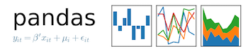

Website about exploring the data behind movies. Brief analyses of the themoviedb.org database.

### [1 - genres (brief overview of data)](pages/post1.md)
### [2 - best friends (simple network analysis)](pages/post2.md)
### [3 - gambling (predicting ratings)](pages/post3.md)
### [4 - recommendations (interactive recommendations)](pages/post4.md)
### [5 - impressions (word clouds)](pages/post5.md)

---
---
The following software was used in the making of this blog.

[themoviedb](https://www.themoviedb.org) | [python](https://www.python.org) | [numpy](https://www.numpy.org) | [scipy](https://www.scipy.org) | [jekyll](https://www.jekyllrb.com)
 |  |  |  | 

[pandas](https://pandas.pydata.org) | [scikit-learn](https://scikit-learn.org/stable/index.html) | [bokeh](https://bokeh.pydata.org/en/latest/) | [matplotlib](https://www.matplotlib.org) | [github](https://github.com)
 |  |  |  | 

---
---

