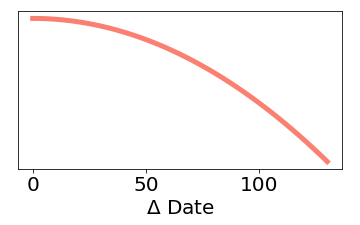

Recommendations
---

<iframe src="https://poptcorn.github.io/assets/post4/recommend.html" width="750" height="400" align="center" frameBorder="0"></iframe>

Go ahead and try out this movie recommendation engine by typing the [exact title](../assets/post4/title_list.txt) of a movie into the textbox and hitting enter. The resulting recommendations can be clicked to take you to the TMDB movie page for those films.

Note that you must type in the year of the film as well since:

 | 

But even that is imperfect because, in 2008, for example:

 |  | 

Caveat emptor I guess.

---

In this post I wanted to make a movie recommendation engine.

I suspect that most movie recommendation engines learn from user interaction over time, which, overall, probably yields fairly helpful suggestions. But I find some movie recommendation sites to be particularly weak with regards to current films. Often, current films seem to yield suggestions for other films that were in theaters at the same time, rather than films that are actually similar to the one in question.

Older films tend to behave more as I would expect, as, I think, they mostly learn from user clicks, so a person will reinforce connections between similar movies. However, the downside to this is that it may be difficult to find films that are similar in terms of actors and directors which are very different in topic.

I want to attempt to recommend films by combining the best of both worlds, finding films which are similar in topic, by using token analysis, and films that are creatively similar but topically different by comparing the meta-information such as writer lists and genre lists.

For the meta-information, I calculate a similarity, for example the genre-similarity, between each film as:

<!--  -->

  

So, if film one has the genre of horror, and film two has the genres of horror and fantasy, the genre similarity between the two is 0.75. This number will always be between zero and one.

The token similarity will compare all the words in the two film descriptions in a similar way, but each word will be upweighted by how common that word is in the total set of words used in the descriptions of all movies in the data:

<!--  -->

  

This should hopefully help to find completely unrelated movies which share high-information descriptors, for example the words "planet" and "laser" are both used in the unconnected films:

 | 

However, there are also some foibles, for example these two films are closest neighbors by the token analysis, because the token "Deckard" is extremely rare:

 | 

The token similarity is then renormalized by dividing by the maximum possible token similarity in the data, so the token distance between any two films is now a value between zero and one.

We finally add similarity factors for the rating and release date, so that the engine will have some weight for similarly rated and released films. We use a square root and a square power for the vote and date differences, respectively (so it will more sharply discriminate between similarly rated films, and less sharply between similar release dates):

 | 

These similarity factors are combined into a total similarity measure:

<!--  -->

  

The constants can be tweaked around to put various weightings on personal preference to highlight films by the same director, or with similar actors, or descriptions, etc.

---
---
I’d like to thank the themoviedb.org folks, who gave me access to their API which was relatively painless to use. I am not affiliated with them in any way and my opinions are my own. I’d also like to thank the developers and maintainers of: Python, scikit-learn, and matplotlib.

themoviedb.org | python.org | bokeh.pydata.org | matplotlib.org
 |  |  | 

---
---
