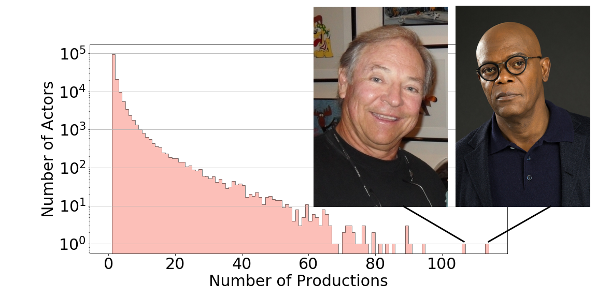
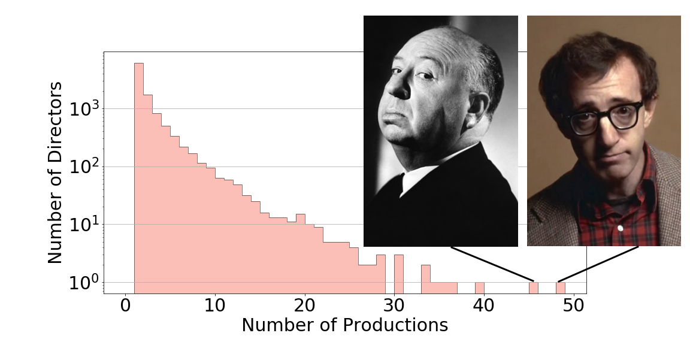
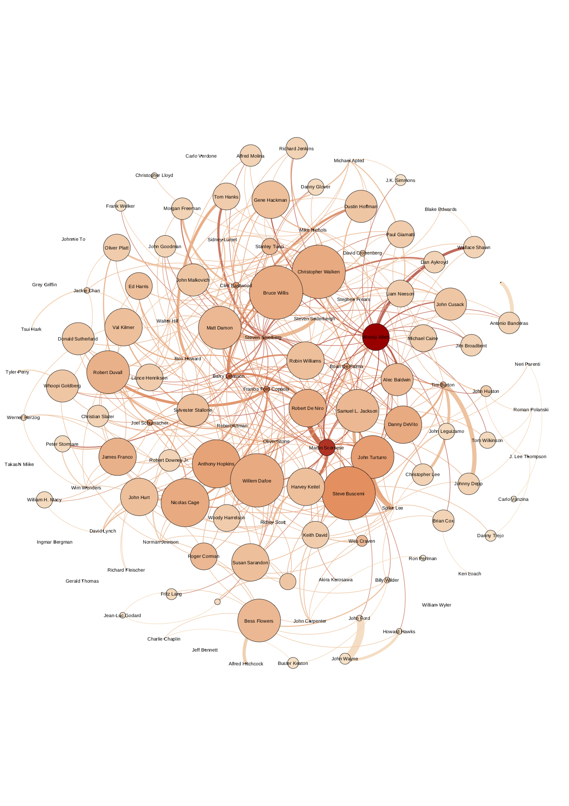
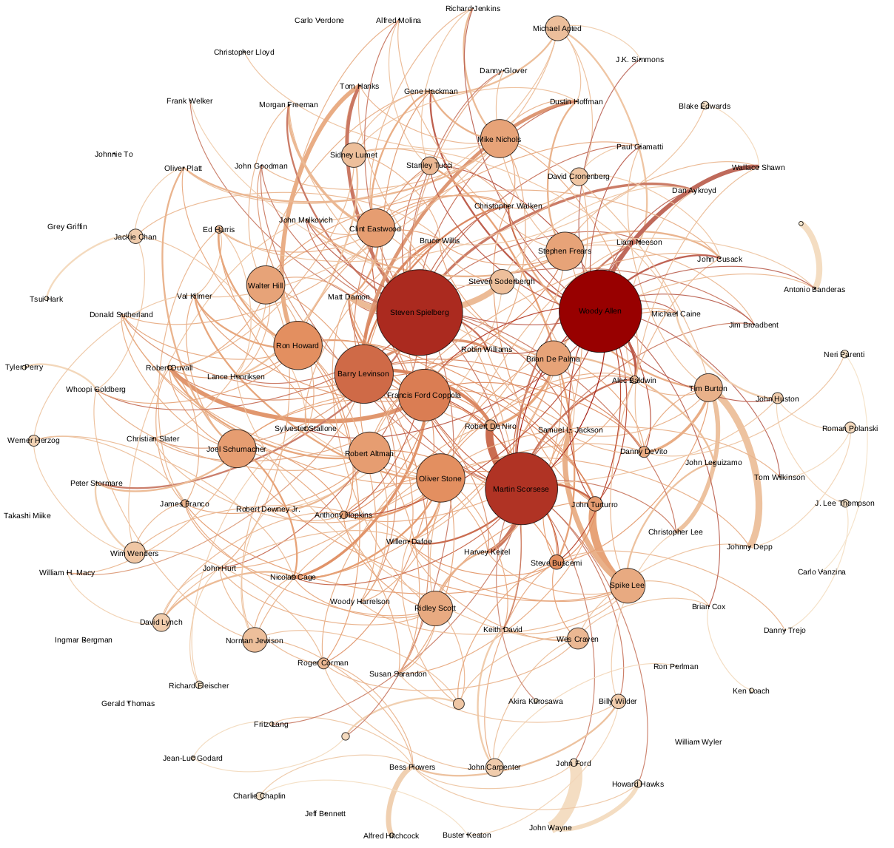

Okay, we've increased our data set from the last post to all movies with more than 10 ratings (down from 50) to a sample of 23,000 movies (up from 9,000). The reason I'm not just pulling everything is that each individual movie query takes me about 4 seconds for some reason. I'm sure there's a better way, but I'll get to it in the future.

Today, I wanted to look at actor-director "best friends." Like in my mind, when I think Quentin Tarantino, I think Samuel L Jackson. Or when I think of Timp Burton, I see Johnny Depp. Last time we looked at genre, year and rating, this time we'll just look at the variables actors and directors.

So first of all, let's look at a simple distribution of our data. First, let's see how many movies actors usually appear in:

ACTORS.PNG

So, to me, I see two regimes: a slowing drop up to acting in 20 movies, then a linear drop after that. If you are in one movie, a portion of actors will get a part in a second movie, if you are in two, a higher portion will get a third, if you are in three a higher percentage will get a fourth... etc, so actors get their foot in the door and it gets relatively easier and easier to get into more movies (note this is log-scaled)... up to 20 movies. At 20 movies, this looks pretty log-linear, so my interpretation is that at 20 movies, you are an established pro, and at that point it's just a matter of how much time you spend acting. This is 100% guessing.

Now those two guys at the top of my data set, I presume no one needs to be told about Samuel L. Jackson. But who's that other guy?! Some of his more famous roles include... "Lion Roars (voice)" *The Lion King* (1994), "Dragon / Animals' Vocal Effects (voice) (uncredited)" *Shrek* (2001), "Abu the Monkey (voice)" *Aladdin* (1992), "Mochi (voice) (uncredited)" *Big Hero 6* (2014)... Laugh all you want, but this guy is no joke:

*"As of September 2010, Welker had voiced or appeared in 93 films with a combined gross revenue of $5.7 billion making him the top grossing actor by this standard (and over $800 million ahead of the next highest grossing actor, Samuel L. Jackson)."* -TMDB description.

If you need some inhuman voicing that's suitable for children's movies, this you your man.

Let's do the same thing with directors:

DIRECTORS.PNG

Immediately we notice that directors do less movies than actors. *Way* less. Some of my favorite directors don't do many at all, like Stanley Kubrick with 16 films and Quentin Tarantino with 17 (and some weird CSI episodes / movie). Something interesting about these top two most prolific directors is that they love to self-cast, Hitchcock (left) does small cameos (like the meta-scene in *Vertigo* [1958] where he walks across the screen directly before the scene where the movie plot and psychological manipulation of the protagonist is revealed), while Woody Allen (right) likes to take main roles (*Annie Hall* [1977], *Manhattan* [1979]).

Now, the fun part. Specific actors loved by specific directors for their ability to convey their unique filmatic messages. I hate to go into the gears here, but I need to, to explain why the following is the way it is. I'm using the network analysis tool Gephi, which takes a list of "nodes" (people) and analyzes "edges" (connections) between them. Initially I wanted to just shove all my directors and all my actors into this and look at all connections between them. But with 150k nodes and 400k edges, the visualization is 100% illegible and my laptop just can't handle the rendering calculation. In the end I opted to only look at director-actor connections (ignoring actor-actor collaborations) and to only look at the ~50 most prolific directors in my dataset and ~60 most prolific actors in my data (I also toyed around with the top ~500 directors and ~6000 actors, with ~30k edges, which my laptop managed to choke out after an overnight run -- but again, the visualization wasn't suitable for a blog). This immediately removes a lot of my favorite directors and my personal impetus for this post (Tarantino - Jackson). But it's what's workable.

Here is the network chart with colors representing total connections, and bubble-size representing total *incoming* connections (ie. acting in a movie makes the bubble bigger).

ACTORS WEB.PNG

And the same thing with *outgoing* connections increasing node-size:

DIRECTORS WEB.PNG

I was hoping to see a kind of pattern with different eras separated into blobs, and different localities in blobs (like a blob for Bollywood, and a blob for Japanese cinema). But since I've just amputated 99% of the data to make it legible and calculable, that geography doesn't exist (also, see the prior post about lacking huge amounts of pre-1970s data). I *may* do a longrun on my work deck over some break to see if I can get this kind of picture, but that's not really possible soon since it's busy with actual work at the moment.

Anyways, I just explored these by eye, and saw some strong connections, tabulated below:

 |  | 
 |  | 
 |  | 
 |  | 

---
---
I’d like to thank the themoviedb.org folks, who gave me access to their API which was relatively painless to use. I am not affiliated with them in any way and my opinions are my own. I’d also like to thank the developers and maintainers of: Python, Gephi, and matplotlib.

themoviedb.org | python.org | gephi.org | matplotlib.org
 |  |  | 

---
---
