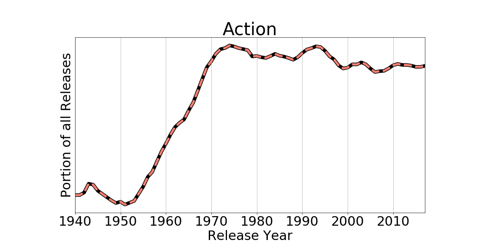
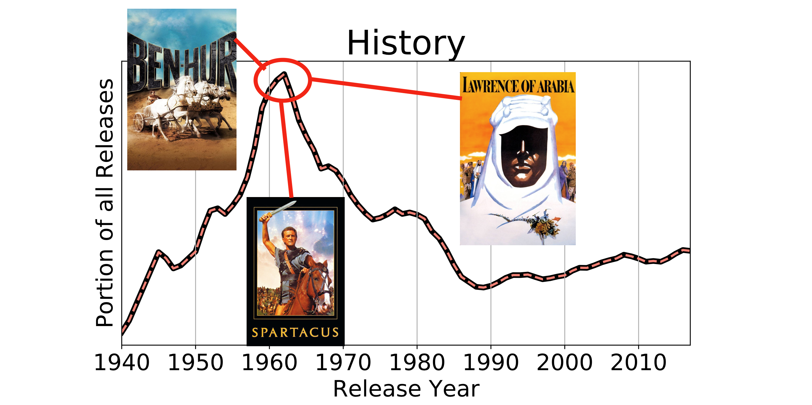

*Genre – a class or category of artistic endeavor having a particular form, content, technique, or the like:*

This is my first post in a series of posts looking at movies and movie-data. In this opening, I’ll just be looking at the variables: genre, average rating and release year. I’m using data collected using the themoviedb.org API, I’ve collected all the entries with more than 50 rating votes, which is a data set of around 9,000 movies.

So, firstly, let’s just look at the distribution of release years in these data:

I don’t think this year distribution really has much meaning, but it looks like what I would expect. I don’t know if we’re are making more films per year as we progress, but I would think that more recent movies are more likely to: a) be entered into this database at all, b) have accrued the 50 votes needed to be in my data set. This is just because of current awareness of movies and the age of the database.

This is related to the distribution of ratings by year as well. The films most likely to be in the public consciousness from half a century ago are probably the outstandingly good or the outstandingly bad — the memorable ones — and the ones most likely to be recirculated by, say, the *Criterion Collection*, are probably the better ones. Niche exceptions like *MST3K* or *Movie Macabre* exist, but I think they’re viewed by a much smaller audience than the *Criterion Collection*. This leads to a “good old days” effect on the average rating by year.

The ratings distribution [(Average, S.D) = (6.35, 0.89)] is close to a Gaussian, but not quite. It’s centered about a standard deviation above the naive average (50%, or 55% on a 1-10 star system), which perhaps says something optimistic about the collective subconscious. However, note the dearth of ratings above 80%, preceded by a sort of cliff at 75%. It seems that people are happy to rate movies as “slightly enjoyable” but turn extremely discerning when asked to rate something as “superb.” Also, there is some hesitance to absolutely thrash a film, the amount of ratings below 40% is, by eye, about the same as above 80%.

Now, onto genres. The distribution of genres and the scores these genres tend to get:

This pie chart represents all the available genres in my data set (labeled on the exterior). The wedges are centered on the average score each genre gets, and the radial extent of the wedges indicates the spread of scores. The global average and range (the Gaussian) are indicated by the solid and dashed circles respectively. The color is also representative of the average score. The angular extent indicates how many films in the data set fall into that particular genre.

This seems about right, the more “cultured” things like Music, Documentary, History, Foreign are rated more highly. But the bulk of our entertainment intake is coming from the low-investment stuff Comedy, Thriller, Drama, Action. Although, I feel bad for Horror (5.83), losing out in ratings even to straight to TV features (5.98)… Bad luck, Horror.

Something cool to look at is the popularity of genres as a function of year:

I went ahead and smoothed this with a decade-wide window and I saw a few things that were interesting, but not entirely unexpected, certain genres have fairly constant popularity, like Action and Comedy, while other genres…

We have the 1950s/1960s golden age of the Western with *High Noon* (1952), *Shane* (1953), *3:10 to Yuma* (1957). Then in the 1960s Sergio Leone’s iconic *Dollars Trilogy* (1964, 1965, 1966) is hunkered right in the middle along with, *The Man Who Shot Liberty Valance* (1962), *Once Upon a Time in the West* (1968), *True Grit* (1969).

History also peaked real hard around the 1960s, I wonder if that’s because of all those hefty epic-length pieces like *The Bridge on the River Kwai* (1957, 2.6 hours), *Ben Hur* (1959, 3.5 hours), *Spartacus* (1960, 3.3 hours), *Lawrence of Arabia* (1962, 3.5 hours)…

Horror seems to go in cycles, with Hitchcock defining the 1960s with psychological pieces like *Psycho* (1960), *The Birds* (1963). Then in the 1980s we saw the rise of the slashers: *Halloween I-V* (1979, 1981, 1982, 1988, 1989), *Friday the 13th* (1980, 1981, 1982, 1984, 1985, 1986, 1988, 1989 [wow]). And of course, possibly the most obsessed over film of all time, Kubrick’s ‘autobiographical’ manifesto *The Shining* (1980) dropping right at the all-time peak of horror popularity.

So when it feels like every time *The Illusionist* (Aug. 2006) comes out someone else comes in with *The Prestige* (Oct. 2006), or you get a sense of deja-vu when *The Red Planet* (Nov. 2000) starts rolling immediately after *Mission to Mars* (Mar. 2000), this might be why. Sorry *Antz* (Oct. 1998), everyone remembers you as *A Bug’s Life* (Nov. 1998) now.

Some genres are also cycle through in tandem like…

In the 1980s Sci-Fi is at a zenith along with Horror: *Star Wars* (1977, 1980, 1983), *Bladerunner* (1982), *E.T.* (1982) *Terminator* (1984), *Ghostbusters* (1984, 1989), *Back to the Future* (1985, 1989), *Aliens* (1986), *They Live* (1988). And Sci-Fi Horror hybrids like *Videodrome* (1983), *Reanimator* (1985), *They Live* (1988) and the towering *Alien* (1979).

We see film Noir in the Crime and Mystery genres peaking together in the 1940s, never to return to their former glory. *The Maltese Falcon* (1941), *Double Indemnity* (1944), *Gaslight* (1944), *Notorious* (1946), *The Big Sleep* (1946), *The Third Man* (1949). Not sure why this fell out of fashion, but it’s worth noting that Action and Adventure rose in popularity as genres prodigiously from 1950-1970.

So, what can we say about current trends? The most striking thing to me is the meteoric rise of the Documentary. They’re being made proportionally more and more every year (perhaps owing to the lowering cost of video production) and they’re consistently one of the highest scoring genres. The earliest documentaries that come to my mind are the Vietnam war documentary pieces which were instrumental in swaying public opinion about the war. Modern documentaries meanwhile, have an enormous range of topics. I think it’s interesting that this rise in documentary popularity coincides with the rise of internet access in the post-2000 world. Not only do we have nearly unlimited information available to us, people seem willing and eager to invest time in learning new things… well, for a comfortably allotted 2 hours at least.

Finally, just for a laugh, in the unsmoothed distributions of the ratings as a function of year (to see if any genres had spectacularly acclaimed years) I saw two strange years that led to hilarious discoveries:

As verified purchaser Sean D on Amazon described Manos: *“I believe this was shot on 8mm film by some college students. The acting is atrocious with a capital A. All of the dialogue was dubbed in after filming. Unless you’re incredibly stoned, avoid this one.”*

aj_guy3181 on IMDb had this to say about The Star Wars Holiday Special: *“The effects are so bad they are hilarious and there seems to be some type of odd porn scene involving Chewbaca’s father and some 70’s Disco Queen. I watched most of the program with my mouth hanging wide open in utter disbelief. The rest of the time I was laughing at just how awful the whole thing really is.”*

I guess I know what I’m watching this weekend.

### End of post, be excellent to each other.
---
---

I’d like to thank the themoviedb.org folks, who gave me access to their API which was relatively painless to use. I am not affiliated with them in any way and my opinions are my own. I’d also like to thank the developers and maintainers of: Python, NumPy, and matplotlib.

themoviedb.org | python.org | numpy.org | matplotlib.org
 |  |  | 

---
---
