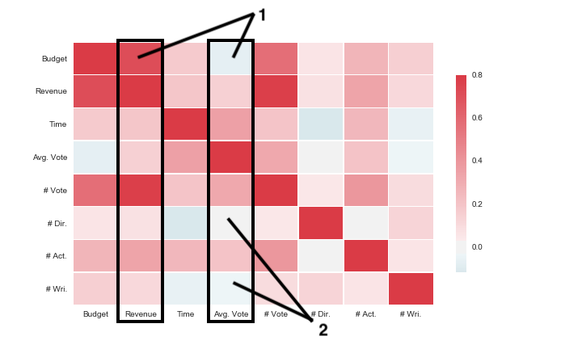

Gambling
---

In this post, I wanted to look at how possible it is to predict a film's success based on attributes we know before release.

The first thing to do would be to look at a simple correlation matrix of the numeric variables to see if any are obviously correlated. For the input variables we have: budget, runtime, number of directors, number of actors, and number of writers. For prediction variables we have: revenue, average vote, and number of votes.

I immediately noticed two things in this correlation matrix:
1) Budget is a decent predictor of revenue (it's also a good predictor of number of votes, I guess higher budget movies have more advertising which increases both of those), but it's negatively correlated with the average vote at the end.
2) Along with a high budget, having more writers seems to lower the final average rating of the film. Maybe artistic collaboration is actually more of a conflict.
3) Longer runtime seems to influence the average rating of a film positively, but has less of an effect on revenue.

Also, it looks like number of votes, budget, and revenue are all highly correlated. This makes sense for high profile films with an advertising campaign.

Anyways, to see if we can predict the success of a film based on the inputs, I just quickly implemented a few simple regressors. Out of our dataset of ~23 thousand items, ~3 thousand have a complete set of attributes. We split this into a training set and and a testing set, and success was determined by the Pearson correlation coefficient between the estimated and true values of the testing set. The algorithms are just a nearest neighbor (KD) and the scikit-learn support vector regression (SV), bayesian regression (BR), and random forest (RF) regression.

Predicting Revenue

KD | 0.54 | 0.52 | 0.54
SV | 0.05 | 0.09 | 0.08
BR | 0.74 | 0.72 | 0.72
RF | 0.75 | 0.71 | 0.75

Predicting Rating

KD | 0.28 | 0.27 | 0.32
SV | 0.20 | 0.22 | 0.21
BR | 0.45 | 0.36 | 0.42
RF | 0.50 | 0.50 | 0.54

Section 2 - actors, directors, writers with the best ratings, consistancy of actors, directors, writers

---
---
I’d like to thank the themoviedb.org folks, who gave me access to their API which was relatively painless to use. I am not affiliated with them in any way and my opinions are my own. I’d also like to thank the developers and maintainers of: Python, Gephi, and matplotlib.

themoviedb.org | python.org | scikit-learn.org | matplotlib.org
 |  |  | 

---
---
