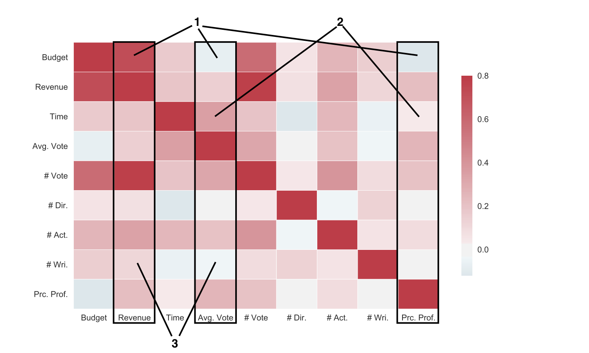
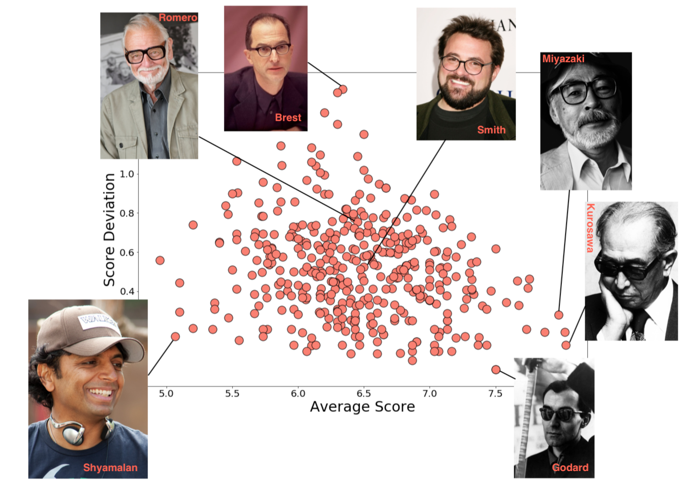
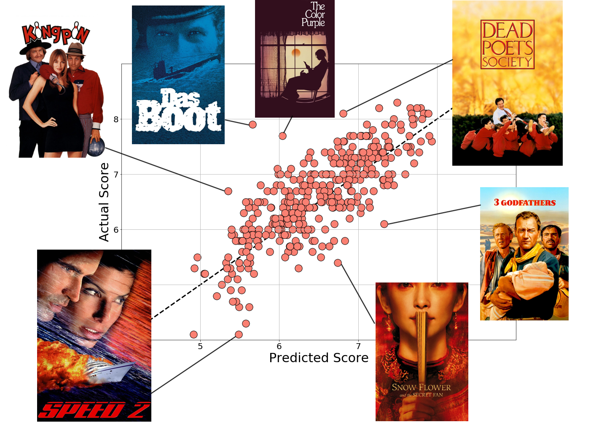
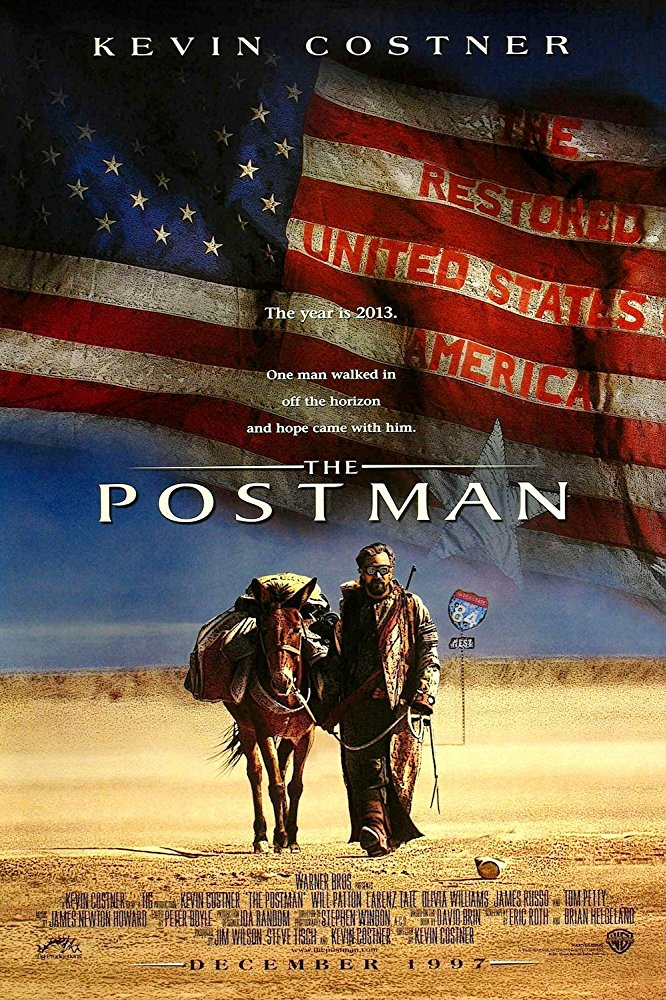

Gambling
---

In this post, I wanted to look at how possible it is to predict a film's success based on attributes we know before release.

The first thing to do would be to look at a simple correlation matrix of the numeric variables to see if any are obviously correlated. For the input variables we have: budget, runtime, number of directors, number of actors, and number of writers. For prediction variables we have: revenue, average vote, and number of votes.

I immediately noticed three things in this correlation matrix:
..1) Budget is a decent predictor of *revenue* (it's also a good predictor of number of votes, I guess higher budget movies have more advertising which increases both of those), but it's *negatively correlated with the average vote and the percent profit at the end.*
..2) Running time is strongly correlated with the final average score, but not very correlated with percent profit.
..3) The number of writers is positively correlated with the revenue but inversely correlated with the final rating. Having multiple directors is also more correlated with higher revenue.

Also, it looks like number of votes, budget, and revenue are all highly correlated. This makes sense for high profile films with large advertising campaigns.

Anyways, to see if we can predict the success of a film based on the inputs, I just quickly implemented a few simple regressors. Out of our dataset of ~23 thousand items, ~3 thousand have a complete set of attributes. We split this into a training set and and a testing set, and success was determined by the Pearson correlation coefficient between the estimated and true values of the testing set. The algorithms are just a nearest neighbor (NN) and the scikit-learn bayesian regression (BR), adaboost.R2 regression (AB), and random forest (RF) regression.

We tabulate the average Pearson correlation coefficients of the predicted and actual values for revenue, percent profit (revenue/budget), and average rating, for a few different training and testing set iterations.

Algorithm | Revenue | Percent Profit | Rating |
Nearest Neighbor | .54 | .12 | .27 |
AdaBoosted Trees | .61 | .28 | .46 |
Bayesian Ridge | .71 | .19 | .38 |
Random Forest | .76 | .31 | .49 |

In the past on other problems, I've tended to have good success with the random forest method, and it seems to perform well on these data as well. All of these predictors work substantially better than the nearest neighbor. As an example of the predictors, we plot the estimations of the different algorithms.

Visually, the random forest and adaboosted trees both perform decently (well better than random) at predicting the final score of a film based on the input data of: budget, runtime, number of directors, number of actors, and number of writers. That's pretty interesting by itself since it means you can predict something about the final score of a film without knowing anyone involved or the genre or any of the information people usually look at when deciding to watch a film.

After this, I'm just going to focus on the rating as the metric for success since I'm more interested in that than the revenue or profitability.

So, let's go ahead and look at the average and deviations of film ratings for directors.

Now, I wasn't going to point out the lowest average rating directors, but the second lowest average was M. Night Shyamalan and that seems completely unfair to me. Say what you will, "Unbreakable" (2000) was a masterpiece.

The actors and writers have similar distributions sort of flaring out from a point at high-ratings, low variability toward lower ratings and with a higher spread in variability. The actor plot has too many points to be fun, and quite honestly I don't recognize a lot of the writers, so we'll just move on.

Using this information -- that actors, directors and writers have distinct average ratings -- I've added into our training data three scores for films, based on their actors, directors, and writers. I used a simple average; so if a movie have 3 actors in it, the actor score is just the average of those three actors' average movie ratings. Some improvement could probably be made using a weighted average based on how many films the different actors have been in as well.

There is a caveat that I'm actually cheating a bit here. I'm calculating an actor / director / writer score based on the entire career of that person, not just up until the release date of the movies that we are attempting to predict a rating for. So an actor's weighted rating is calculated using information from the films we are trying to predict weightings for. **That's a big no-no.** A more proper technique would be to redefine a training set for each movie consisting of all movies released prior to it and recalculating the actor / director / writer scores based on this subset. I'm not doing it that way because it's just too computationally time intensive at the moment.

Adding this information into the random forest yields some pretty impressive predictive ability. We have a correlation coefficient of about 0.8 (compared to ~0.5 without the actor, director, and writer score averages for the same random forest algorithm) between our predicted film rating and the actual film rating.

There're a few interesting outliers to the algorithm. Most notably I would say are: (1) "Speed 2" (1997) which had high profile actors Sandra Bullock and Willem Dafoe which possibly buoyed the predicted score; and (2) "Dead Poets Society" (1989) which might have been predicted too low because of Robin Williams' comedy career (since comedy generally scores quite a bit lower than drama).

There is more information that could be added into this predictor, for example the [genre](https://poptcorn.github.io/pages/post1.html) of the film tends to have an effect on the audience rating. We could also overtrain by considering the release date, which we have seen before is biased to higher scores for older movies (which I would say is only relevant in this data set, and doesn't help with predicting new film scores). Or there might also be a title effect, I would expect sequels to have longer titles on average (including subtitles) and lower scores on average.

That aside, in the end, I would have to say *yes, we can predict with reasonable accuracy if a random film will end up being a highly rated film or not.* In my opinion this doesn't really mean much though, since some of the best films are most certainly not "good" films. Like some of my personal favorites below.

Buckaroo Banzai (1984; 64%) | Cherry 2000 (1987; 59%) | Knightriders (1981; 61%) | Postman (1997; 61%)
 |  |  | 

---
---
I’d like to thank the themoviedb.org folks, who gave me access to their API which was relatively painless to use. I am not affiliated with them in any way and my opinions are my own. I’d also like to thank the developers and maintainers of: Python, scikit-learn, and matplotlib.

themoviedb.org | python.org | scikit-learn.org | matplotlib.org
 |  |  | 

---
---
