Impressions
---

Here I thought I'd just do something simple and make some word-clouds for each genre. There's not much too this, I just catenated all the overviews in any given genre and calculated the frequencies of every word. The specific frequency is then that value divided by the frequency of that word in the total data set. So if the word 'Sherlock' occurs 5 times in the mystery genre out of 100 total words, and 5 times in the total set of overviews, out of 1000 words, its specific frequency in mystery is 10.

Name tokens like this (i.e. 'Sherlock,' 'Scooby,' 'Poirot,' 'Kolchak' in the mystery genre) will often have the highest genre-specific-frequencies, so we only accept tokens which occur more than 100 times in the total data set. Then our word clouds look about right with words like 'investigate,' 'murder,' and 'detective.'

Here is a little thumbnail gallery.

**Action** | **Adventure** | **Animation**
 | [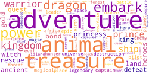](https://poptcorn.github.io/assets/post5/fullsize/Adventure.jpg) | 
**Comedy** | **Crime** | **Documentary**
 |  | 
**Drama** | **Family** | **Fantasy**
 | [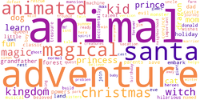](../assets/post5/fullsize/Family.jpg) | [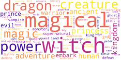](../assets/post5/fullsize/Fantasy.jpg)
**Foreign** | **History** | **Horror**
 |  | 
**Music** | **Mystery** | **Romance**
 |  | 
**Science Fiction** | **Thriller** | **TV Movie**
 |  | 
**War** | **Western**
 | 

---
---
I’d like to thank the themoviedb.org folks, who gave me access to their API which was relatively painless to use. I am not affiliated with them in any way and my opinions are my own. I’d also like to thank the developers and maintainers of: Python, word_cloud, and matplotlib.

[themoviedb](https://www.themoviedb.org) | [python](https://www.python.org) | [word_cloud](https://www.github.com/amueller/word_cloud) | [matplotlib](https://www.matplotlib.org)
 |  | 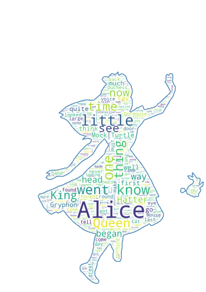 | 

<!--

---
---

---
# Mystery
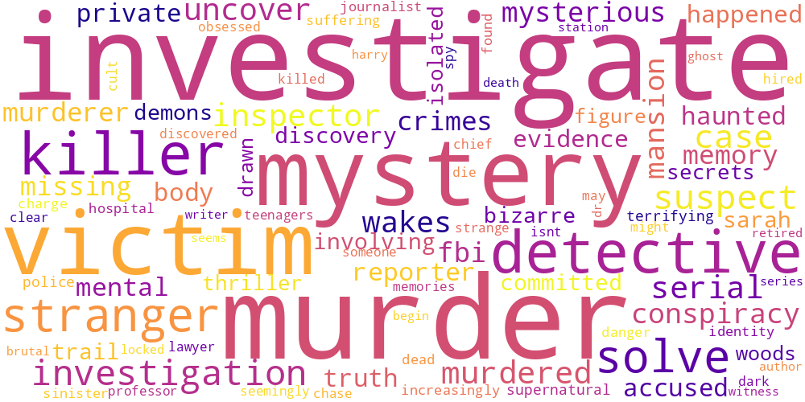

---
# Documentary
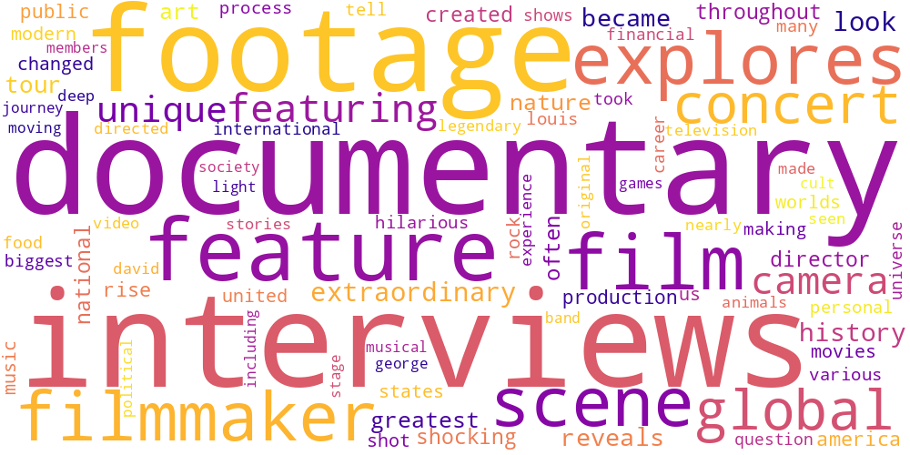

---
# Foreign
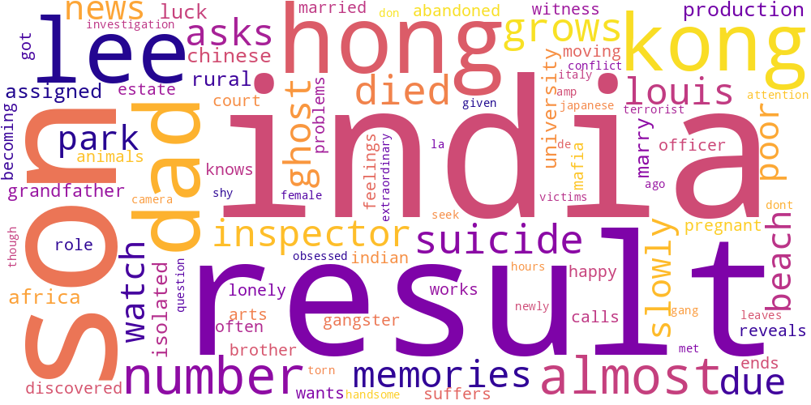

---
# Drama

---
# Animation
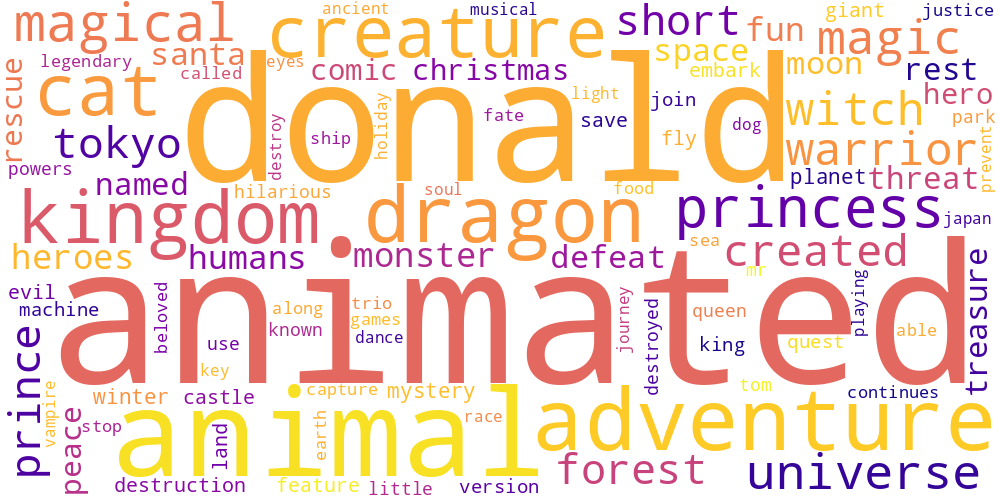

---
# Action
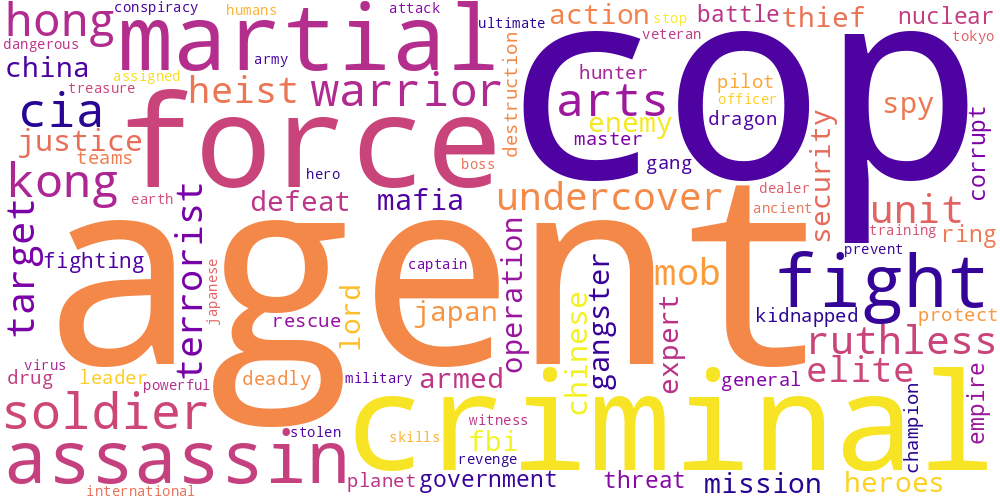

---
# Music

---
# Fantasy
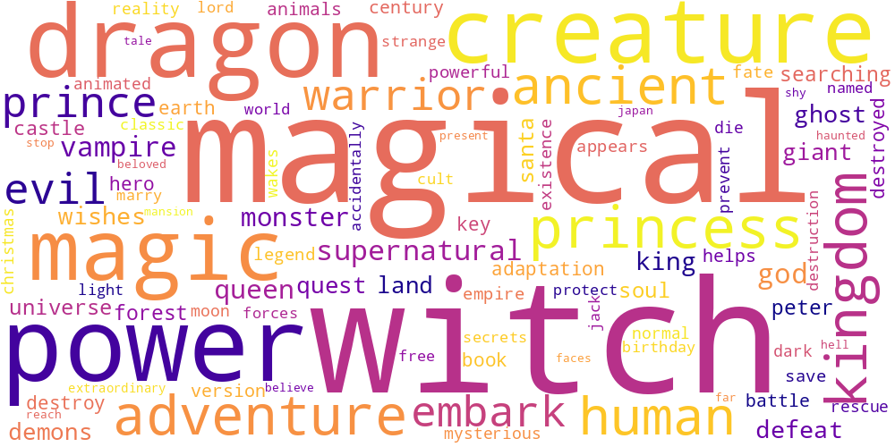

---
# Romance
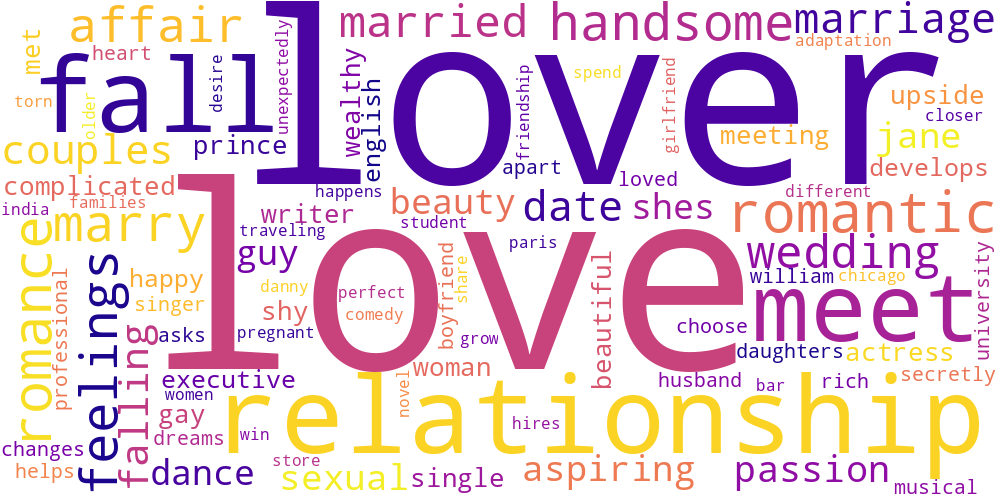

---
# Crime
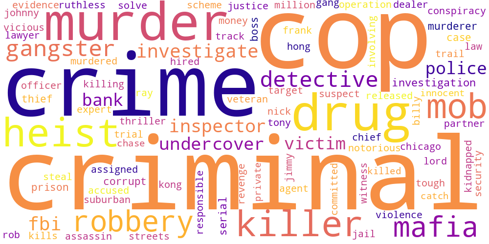

---
# Adventure
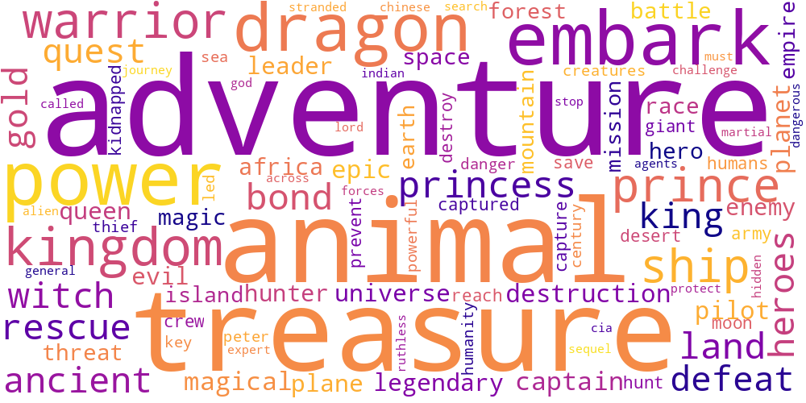

---
# History

---
# TV Movie
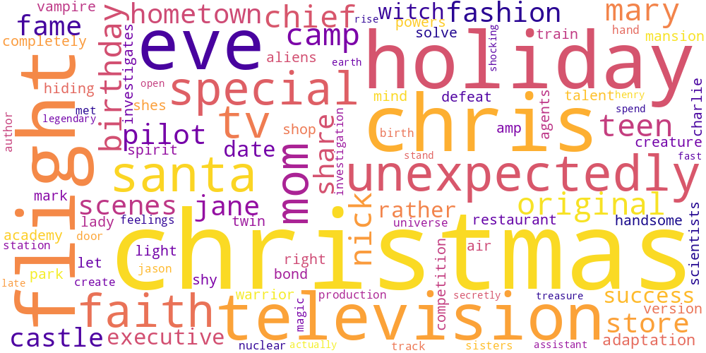

---
# Comedy

---
# Science Fiction
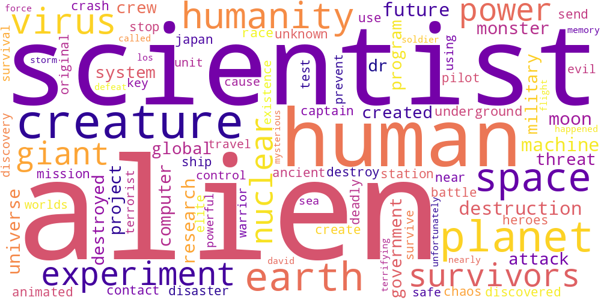

---
# Western
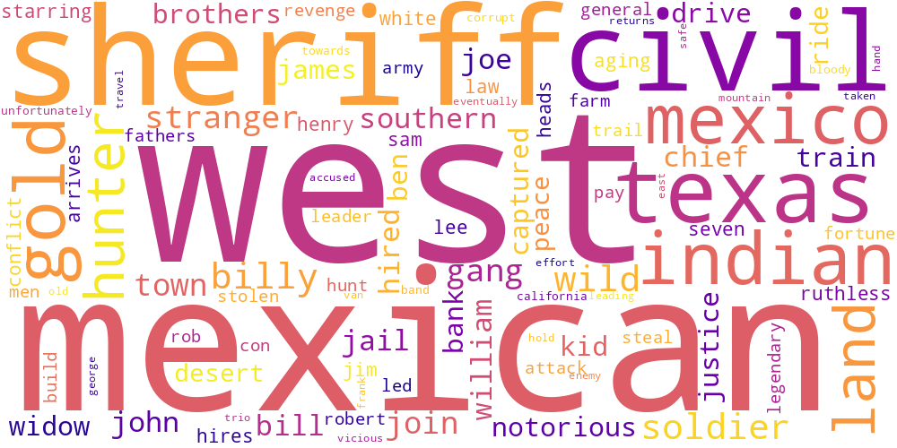

---
# Family
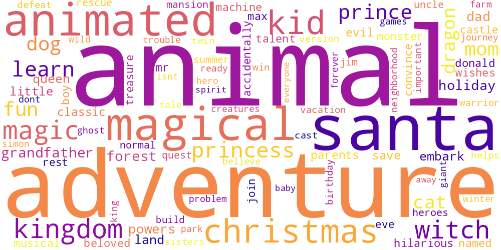

---
# Horror
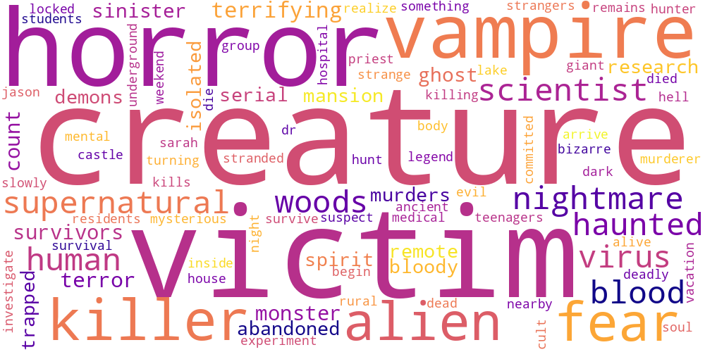

---
# War
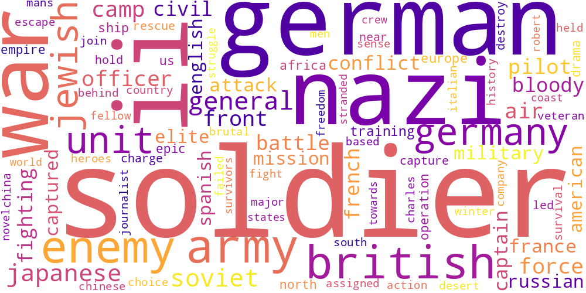

---
# Thriller
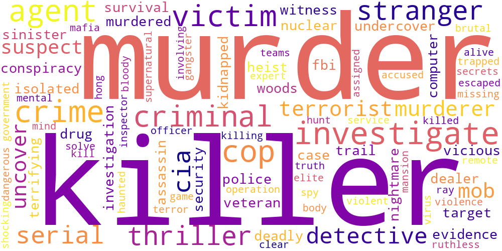

-->
